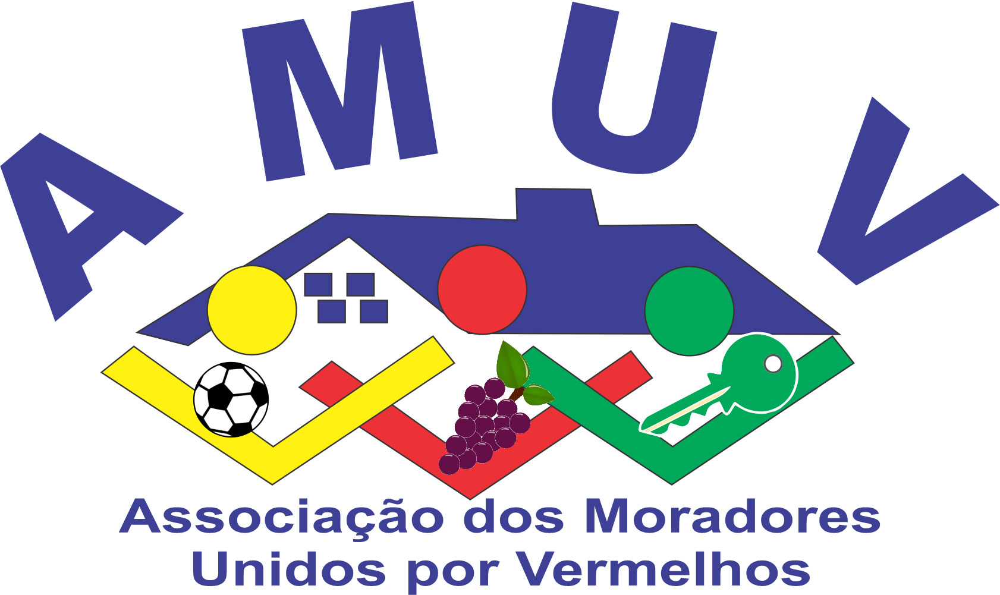
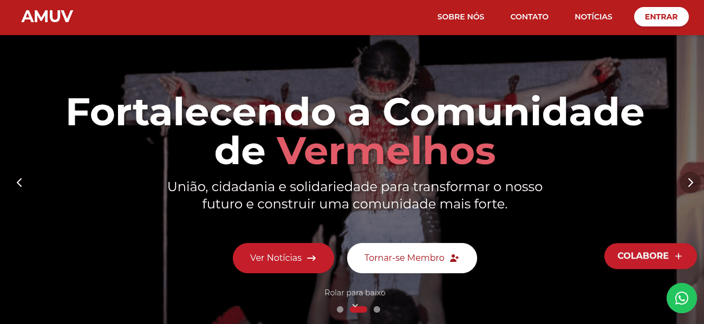
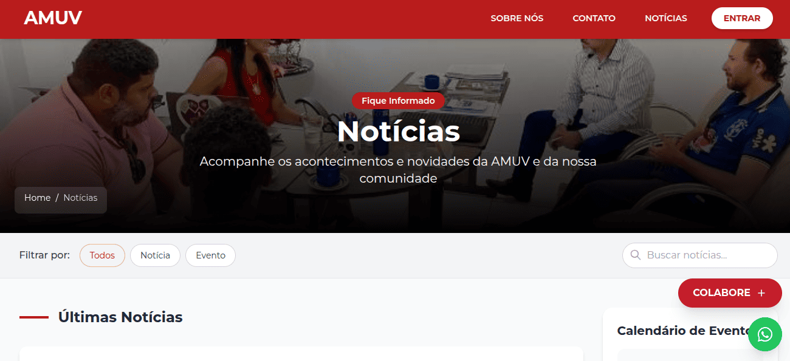
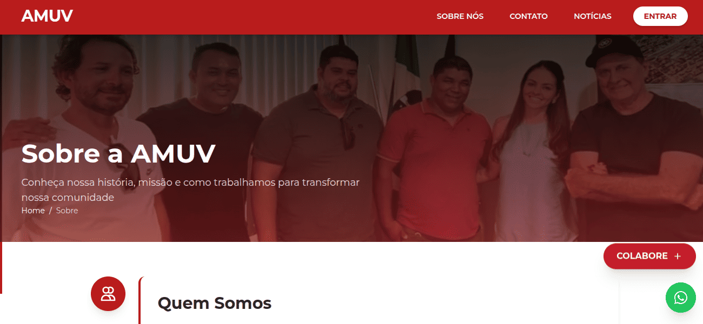
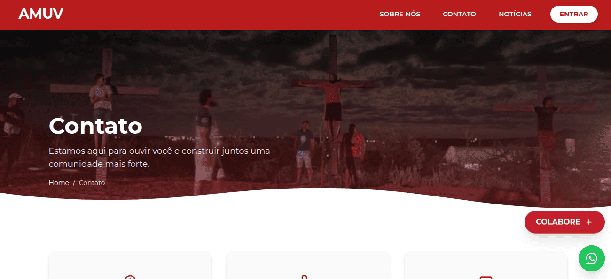
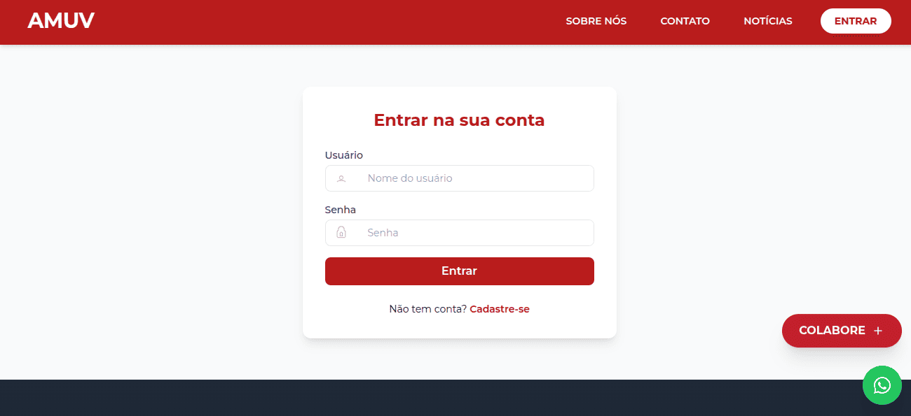
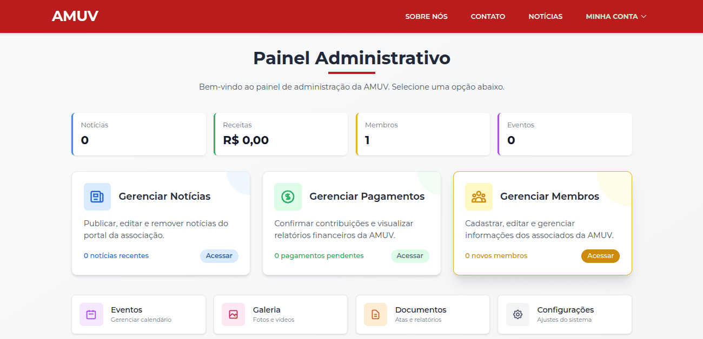

# 📢 AMUV - Portal da Associação dos Moradores Unidos por Vermelhos



Portal oficial da Associação AMUV, oferecendo:
- 📢 Notícias e Comunicados Públicos
- 🏡 Área Restrita para Membros
- 💳 Gestão de Pagamentos de Mensalidade
- 📈 Painel Administrativo com Relatórios e Estatísticas

---
## 📸 Telas do Sistema

### Página Inicial



### Página Notícias



### Página Sobre Nós



### Página Contato



### Área de Login



### Área Administrativa



---

## 🚀 Tecnologias Utilizadas

- **Backend**: Python, Django
- **Frontend**: HTML5, TailwindCSS, Alpine.js
- **Banco de Dados**: PostgreSQL (Produção) / SQLite (Desenvolvimento)
- **Servidor**: Gunicorn + Nginx (produção)
- **Outros**: Docker (opcional), Django REST Framework (caso futuro)

---

## ⚙️ Como Rodar Localmente

1. **Clone o projeto:**

```bash
git clone https://github.com/wallisonc2k/amuvsite.git
cd amuvsite
```

2. **Crie e ative um ambiente virtual:**

```bash
python -m venv venv
source venv/bin/activate   # Linux/Mac
venv\Scripts\activate      # Windows
```

3. **Instale as dependências:**

```bash
pip install -r requirements.txt
```

4. **Configure o ambiente:**

Copie o exemplo de variáveis de ambiente:

```bash
cp .env.example .env
```
E edite com suas configurações locais (como chave secreta do Django, dados do banco etc).

5. **Prepare o banco de dados:**

```bash
python manage.py migrate
```

6. **Crie um superusuário para o admin:**

```bash
python manage.py createsuperuser
```

7. **Suba o servidor de desenvolvimento:**

```bash
python manage.py runserver
```

Acesse: [http://127.0.0.1:8000](http://127.0.0.1:8000)

---

## 🗃️ Estrutura Básica do Projeto

```bash
amuv_portal/
├── manage.py
├── amuv_portal/          # Configurações globais
│   ├── settings/
│   │   ├── base.py
│   │   ├── dev.py
│   │   └── prod.py
│   └── urls.py
├── apps/                 # Aplicativos internos
│   ├── news/             # App de Notícias
│   ├── members/          # App de Gestão de Membros
│   ├── payments/         # App de Controle de Mensalidades
│   └── core/             # Páginas públicas
├── static/
├── media/
├── templates/
├── requirements.txt
└── README.md
```

---

## 🛡️ Boas Práticas e Segurança

- Variáveis sensíveis estão no `.env`
- Senhas nunca são salvas em texto puro
- Proteção CSRF e validações de formulários ativas
- Acesso a área de membros controlado via Django Permissions

---

## 👨‍💻 Contribuição

1. Faça um Fork 🚀
2. Crie sua Branch: `git checkout -b minha-nova-funcionalidade`
3. Commit suas mudanças: `git commit -m 'feat: Minha nova funcionalidade'`
4. Push para a Branch: `git push origin minha-nova-funcionalidade`
5. Abra um Pull Request!

---

## 📄 Licença

Este projeto é licenciado pela [MIT License](LICENSE).

---
